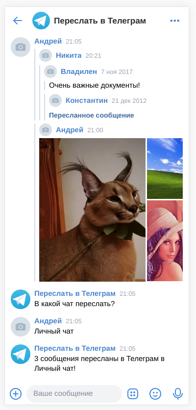
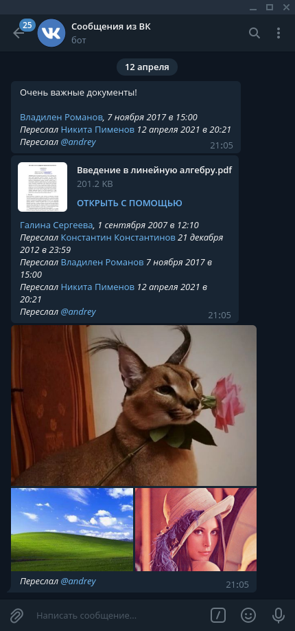

## Постановка задачи
При общении в телеграме нередко возникает надобность пересылки фрагментов переписки из вконтакта. Задача усложняется тем, что сообщения вконтакта могут иметь сложную многоуровневую структуру, так как они, в отличии от сообщений телеграма, могут иметь прикреплёнными не только медиа, но и другие сообщения. Поэтому пересылать все эти вложения вручную проблематично, хотелось бы иметь такой простой инструмент: пересылаешь сообщения боту ВК -- получаешь сообщения от бота в ТГ.

## Настройка
Перед запуском бота необходимо указать токены в файле `config`.

#### Получение Телеграм-токена
Придумываем название и никнейм для телеграм-бота, сообщаем их боту **@BotFather**, получаем от него токен.

#### Получение токена ВКонтакте
Создаём произвольное сообщество ВКонтакте (бот будет работать от его имени). Переходим в раздел **Управление**, в меню **Настройки** выбираем **Работа с API**. Нажимем **Создать ключ** и даём ему **доступ к сообщениям**.

## Схема работы
*Ещё не всё реализовано!*

Связка аккаунтов ВК и ТГ:
Новый пользователь пишет `/start` боту в ТГ, бот присылает ему временный уникальный код. Пользователь открывает бота ВК и отправляет код ему.

Теперь пользователь может переслать любые сообщения ВК боту. В ответ бот спрашивает, в какой ТГ чат переслать сообщения. Пользователь выбирает один из предложенных вариантов, осуществляется пересылка.

Чтобы можно было пересылать не только в личный чат, администратор чата в телеграмме должен добавить бота туда и сообщить ему, каким пользователям разрешено пересылать сообщения в этот чат.

## Аналоги
Единственное готовое опен сорс решение, которое удалось найти -- [Vk-to-telegram-transfer-bot](https://github.com/Whiletruedoend/Vk-to-telegram-transfer-bot). Но у него есть несколько существенных недостатков:
1. Не умеет обрабатывать вложенные сообщения. Пересылает медиа отдельными сообщениями.
2. Заточен под полную синхронизацию чатов ВК и ТГ, настройки чатов нужно предварительно хардкодить.
3. Использует апи вк-пользователей, а не вк-ботов, поэтому для его работы нужно регистрировать отдельный аккаунт вконтакте, что очень неудобно.
